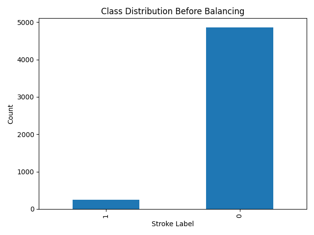
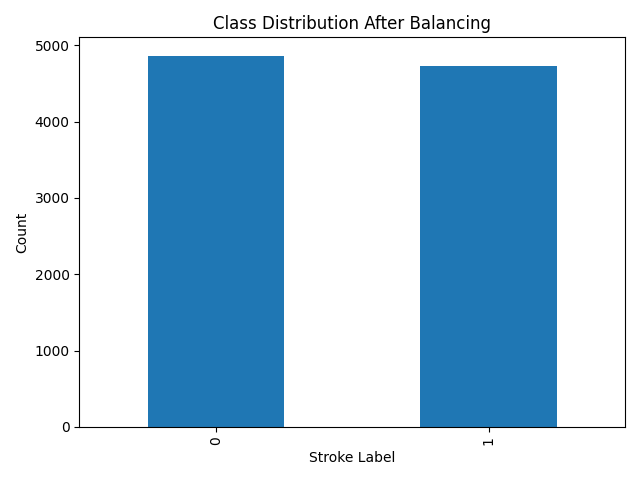
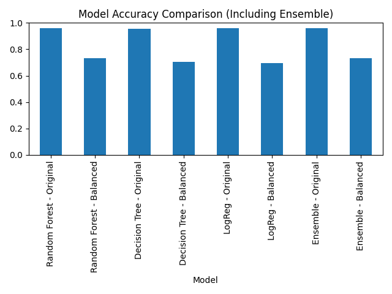

# 📱 Human Activity Recognition using Smartphone Sensor Data (PySpark)

This project classifies human activities using smartphone sensor data (accelerometer & gyroscope) with a scalable machine learning pipeline built using **PySpark**. The goal is to predict whether a subject is at risk of **stroke** based on personal and activity-level features.

---

## 📂 Files in this Repository

- `HAR_analysis.ipynb` – Jupyter notebook with full PySpark pipeline
- `class_distribution_before.png` – Class imbalance before balancing
- `class_distribution_after.png` – Class distribution after balancing
- `accuracy_comparison_ensemble.png` – Accuracy comparison of all models (including ensemble)

---

## 🎯 Objective

To build a scalable machine learning workflow to classify stroke risk based on activity data collected from smartphone sensors, using:

- 📊 Exploratory Data Analysis
- 🔄 Data Balancing (oversampling)
- 🧠 ML models (Random Forest, Decision Tree, Logistic Regression)
- 🧠 Ensemble Voting (hard voting strategy)
- 📈 Metrics (Accuracy, F1, Precision, Recall)

---

## 📚 Dataset Overview

- **Source**: UCI HAR Dataset (adapted)
- **Samples**: ~5,000+
- **Sensors**: Accelerometer, Gyroscope
- **Labels**: `0` = No Stroke, `1` = Stroke Risk

---

## 🔍 Class Distribution

### Before Balancing


### After Balancing


---

## 🧠 Models Used

- Random Forest
- Decision Tree
- Logistic Regression
- 🧠 **Ensemble (Hard Voting)**

All models were trained on original and balanced datasets for comparison.

---

## 📈 Accuracy Comparison



---

## 🛠️ Technologies

- Apache Spark (PySpark)
- Google Colab / Jupyter
- Pandas, Matplotlib (for visuals)
- MulticlassClassificationEvaluator
- MulticlassMetrics (confusion matrix, F1, precision, recall)

---

## 🚀 How to Run

1. Clone the repo:
   ```bash
   git clone https://github.com/RamKishoreKV/Human-Activity-Recognition-PySpark.git

2. Open HAR_analysis.ipynb in Google Colab or Jupyter
3. Make sure PySpark is installed
4. Run all cells step-by-step
5. Make sure Dataset is mounted properly
📌 Results Summary
Best Accuracy: Ensemble on Balanced Dataset

Key Insight: Balancing data improved all model metrics significantly

Confusion Matrices: Printed for all models

🙌 Acknowledgments
UCI Machine Learning Repository – Human Activity Dataset

Google Colab + PySpark

MulticlassClassificationEvaluator (Apache Spark MLlib)

📬 Author
Ram Kishore KV
M.S Data Science
Drexel University


